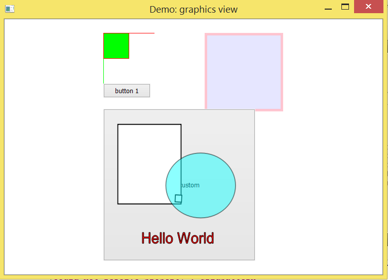

Title: Qt上GraphicsView显示SVG
Date: 2016-03-26 10:20
Modified: 2016-03-26 19:30
Category:   
Tags: reading, 
Slug: Qt上GraphicsView显示SVG  
Authors: 

svg Demo 
---- 

 
                                                                                    
in this small qt demo, try to learn a bit of the Graphics View framework.                
1. scene, add items to scene, use view to show the scene;                 
2. load and display svg;                                             
3. add widget to scene, graphicsitem->graphicsobject(signal/slot)                     
   ->graphicswidget(custom widget)->graphicsProxyWidget(use with QWidget).           
4. svg as icon added to a button. by using button, we have the hover state.             
